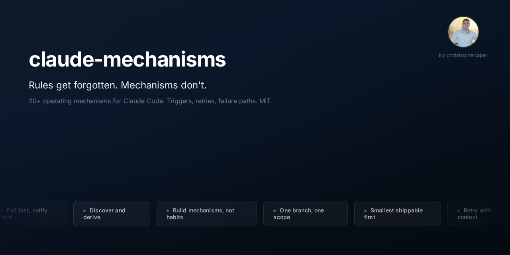

> "Good intentions don't work. Mechanisms do." -- Jeff Bezos

Operating mechanisms codified from working with Claude Code every day. Distilled into the ones that actually stuck.

Not rules (rules get forgotten between sessions). Not principles (too abstract to enforce). **Mechanisms** -- with triggers, retry logic, and failure notifications that fire whether you remember them or not.

## Why mechanisms, not rules?

Early on, when something went wrong, I'd ask Claude to prevent it happening again. It would write a rule or save a note in memory. Next session? Gone. So I started thinking harder about what actually sticks.

A mechanism has:
- A **clear trigger** (not manual memory)
- **Consistent execution** when the trigger fires
- A **defined expected outcome**
- **Retry logic** (up to N attempts) when the outcome isn't met
- A **failure notification** if retries are exhausted -- never fail silently

## The mechanisms

| # | Mechanism | One-liner |
|---|---|---|
| 01 | [Discover and derive, never assume or ask](mechanisms/01-discover-and-derive.md) | Check before creating, derive before asking, discover before computing |
| 02 | [git mv, not cp + rm](mechanisms/02-git-mv-not-cp-rm.md) | Preserve history when moving files |
| 03 | [No orphaned files](mechanisms/03-no-orphaned-files.md) | If content migrates, delete the source |
| 04 | [One focused thing per session](mechanisms/04-one-focused-thing-per-session.md) | Resist scope creep |
| 05 | [Deferred work needs persistent markers](mechanisms/05-deferred-work-needs-persistent-markers.md) | Write flags, not verbal promises |
| 06 | [Fix conflicts autonomously](mechanisms/06-fix-conflicts-autonomously.md) | Fix it directly, don't surface the problem |
| 07 | [Build mechanisms, not habits](mechanisms/07-build-mechanisms-not-habits.md) | The meta-mechanism that defines all others |
| 08 | [Incremental rollout, not big-bang swap](mechanisms/08-incremental-rollout-not-big-bang-swap.md) | Add alongside, verify, then remove the old |
| 09 | [Atomic credential persistence](mechanisms/09-atomic-credential-persistence.md) | Persist replacements before doing any other work |
| 10 | [Parity over independence](mechanisms/10-parity-over-independence.md) | Test that N things work the same, not just individually |
| 11 | [One branch, one scope](mechanisms/11-one-branch-one-scope.md) | Branch frozen once PR is ready; verify scope before committing |
| 12 | [Consolidate review in the artifact](mechanisms/12-consolidate-review-in-artifact.md) | Put proposed changes inside the file, not in chat |
| 13 | [Dry-run before committing data-patching scripts](mechanisms/13-dry-run-before-data-patching.md) | Test scripts against real data, not just synthetic tests |
| 14 | [Trace the cascade](mechanisms/14-trace-the-cascade.md) | Walk every downstream consumer before finalizing a pipeline change |
| 15 | [Build callables, not embedded logic](mechanisms/15-build-callables-not-embedded-logic.md) | One script, multiple callers, same behaviour |
| 16 | [Smallest shippable first](mechanisms/16-smallest-shippable-first.md) | Ship the smallest slice that validates the hypothesis |
| 17 | [Structural checks use hooks, not behavioral rules](mechanisms/17-structural-checks-use-hooks.md) | Enforce objective checks with hooks; reserve rules for judgment calls |
| 18 | [Safest path first on destructive ops](mechanisms/18-safest-path-first-destructive-ops.md) | Backup, replace, verify, parallel-run, confirm, then destroy |
| 19 | [Detection rules: more specific patterns, never broader allowlists](mechanisms/19-detection-rules-specific-patterns.md) | When a detector misses, tighten the pattern, never loosen the allowlist |
| 20 | [Hooks silent on pass](mechanisms/20-hooks-silent-on-pass.md) | Pass prints nothing; warn prints one line; block denies with full detail |
| 21 | [Structural intervention beats pattern N+1](mechanisms/21-structural-intervention-beats-pattern-n-plus-1.md) | After two rounds of patterns on the same detector, the third round is architectural |

## Quick start

**Option 1: Copy what you need**

Browse the [mechanisms/](mechanisms/) directory. Each file is self-contained. Copy any mechanism into your own `CLAUDE.md` or project configuration.

**Option 2: Install as a Claude Code plugin**

```bash
git clone https://github.com/christophecapel/claude-mechanisms.git ~/.claude/plugins/claude-mechanisms
```

## Tools that implement these mechanisms

Mechanisms describe how the work should be done. Tools enforce it. The companion repo [`claude-mechanisms-tools`](https://github.com/christophecapel/claude-mechanisms-tools) packages tools that each implement one or more mechanisms here.

v0.1 — Session Hygiene (3 tools):

| Tool | Implements | Kind |
|---|---|---|
| [`/check`](https://github.com/christophecapel/claude-mechanisms-tools/blob/main/skills/check/check.md) | [#16](mechanisms/16-smallest-shippable-first.md), [#11](mechanisms/11-one-branch-one-scope.md), [#1](mechanisms/01-discover-and-derive.md) | skill |
| [`worktree-edit-gate`](https://github.com/christophecapel/claude-mechanisms-tools/blob/main/hooks/worktree-edit-gate.py) | [#17](mechanisms/17-structural-checks-use-hooks.md), [#11](mechanisms/11-one-branch-one-scope.md) | hook |
| [`/press1-check`](https://github.com/christophecapel/claude-mechanisms-tools/blob/main/skills/press1-check/audit-permissions.py) | [#21](mechanisms/21-structural-intervention-beats-pattern-n-plus-1.md), [#19](mechanisms/19-detection-rules-specific-patterns.md) | skill+script |

v0.2 — Plan Discipline (2 tools):

| Tool | Implements | Kind |
|---|---|---|
| [`plan-review-gate`](https://github.com/christophecapel/claude-mechanisms-tools/blob/main/hooks/plan-review-gate.py) | [#14](mechanisms/14-trace-the-cascade.md), [#16](mechanisms/16-smallest-shippable-first.md), [#17](mechanisms/17-structural-checks-use-hooks.md) | hook (PreToolUse on `ExitPlanMode` + `Bash`) |
| [`/plan-archive`](https://github.com/christophecapel/claude-mechanisms-tools/blob/main/skills/plan-archive/SKILL.md) | [#5](mechanisms/05-deferred-work-needs-persistent-markers.md) | skill+script |

Each mechanism in this catalog with at least one implementation has an `## Implementations` section linking forward to the tool. The full cross-link manifest is in [`mechanisms.yaml`](mechanisms.yaml) under the `implementations:` field of each mechanism.

## About

Built by [Christophe Capel](https://github.com/christophecapel) -- a product leader building a personal operating system with Claude Code and codifying the discipline that makes it work.

These mechanisms emerged from real failures: wrong-branch commits, lost credentials, orphaned files, scope creep across parallel sessions, and rules that Claude forgot between conversations. Each one exists because something broke and I made sure it wouldn't break the same way twice.

If any of these save you time, I want to hear about it. If you have mechanisms of your own, open a PR or an issue.

## License

MIT
